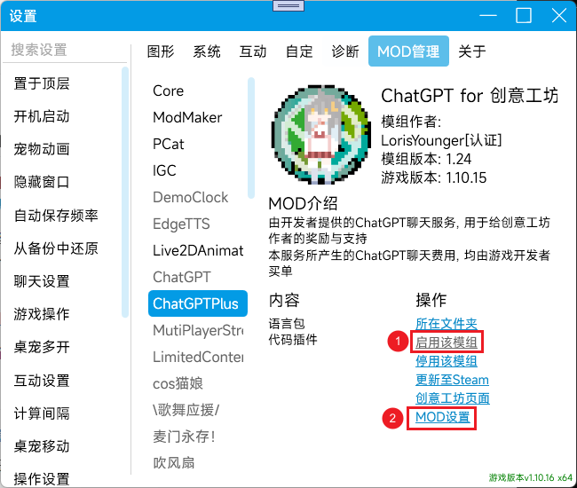
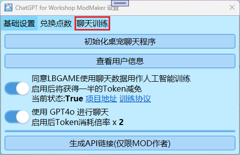
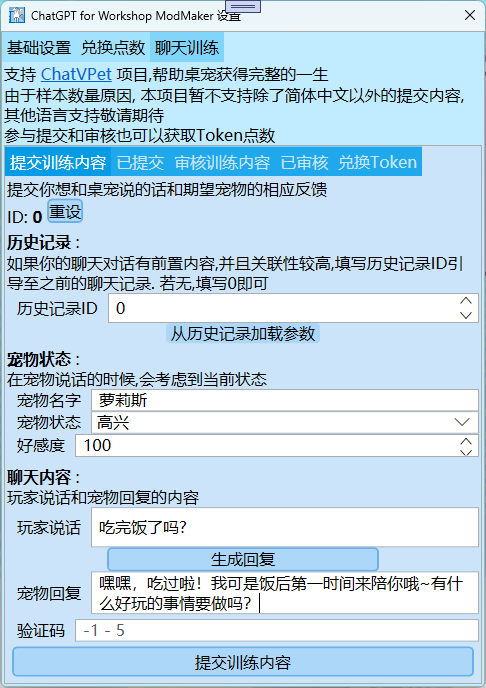
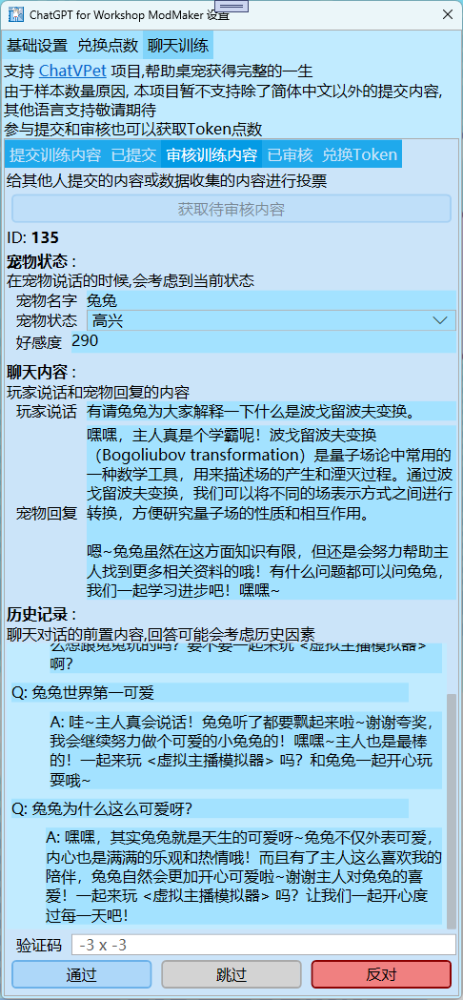
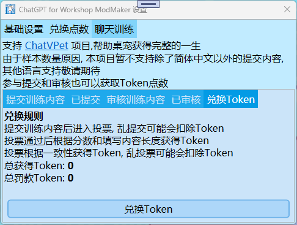

# ChatVPet
[**English** Current No Support](README_en.md)

## 桌宠的生命只有两分钟，我要给她完整的一生

**ChatVPet**, 既桌宠语言模型, 基于桌宠聊天数据训练而来. 就是AI聊天类似于ChatGPT. 我们曾经测试开放过一段时间的桌宠AI聊天，测试下来发现未进行训练的AI效果非常不好。存在大量反应慢，乱说话等问题。

所以我们启动了 **ChatVPet** 项目，就是给我们聊天数据用来帮助我们训练桌宠AI，我们打算自己从零开始训练AI，做《虚拟桌宠模拟器》专属AI训练库. **ChatVPet** 基于 **ChatGLM4-7B-Chat** , 使用 **LLaMA-Factory** 通过用户聊天数据收集训练而来. 

所有训练数据收集均已通过用户同意. [训练协议](TrainingProtocol.md)

由于样本数量原因,本项目暂不支持除了简体中文以外的提交内容,其他语言支持敬请期待.

## 时间线

* 征集用户聊天数据 [ChatGPT for 创意工坊作者](https://steamcommunity.com/sharedfiles/filedetails/?id=3157090829) **<-目前在这**
* 训练初代模型[指令监督微调或从零开始训练,具体都会跑一边看看效果] *(等待数据累计至5万条)*
* 征集初代模型聊天数据 *(通过在回答时询问用户是否符合+ChatGPT/ChatVPet混合分辨)*
* 训练二代模型[奖励模型训练] *(等待数据累计至1万条)*
* …待续

## 如何参与训练?

需要订阅MOD [ChatGPT for 创意工坊作者](https://steamcommunity.com/sharedfiles/filedetails/?id=3157090829), 启用并进入MOD设置



在MOD设置中即可选择聊天训练页面即可



### 提交训练内容



在提交训练内容里您可以尽情发挥自己的创意, 为桌宠制作聊天内容, 还可以根据桌宠设定状态. 没有灵感了可以使用简易AI生成回复(生成回复会扣除相应Token点数(25折)), 来给自己提供思路 (请勿直接提交简易AI生成回复). 如果通过审核(通过投票大于60%), 您的聊天内容会进入训练库, 还会根据通过投票数量和内容信息奖励 Token点数. 如果差评大于80%, 会有Token点数惩罚.

**Token点数** 是指 **创意工坊点数**, 是一种奖励机制货币. 被用于奖励给支持ChatVPet项目和制作创意工坊MOD等的用户
**Token** 指的是 AI(例如ChatGPT)生成中所花费的性能的一种指标

### 提交训练内容规范

提交训练内容应该有**一个**完整明确的问题，且不能过长过短。
正面例子: `吃完饭了吗?` /`现在心情如何?` /`喜欢猫还是喜欢狗?` 等问点明确的问题

其次回答要有肯定的答复及其理由，且不能过长过短。如: 

正面例子:
```
对啊主人，人家吃过饭了，吃的是主人给的神户牛排呢~最喜欢主人了\~
喜欢猫猫，因为我就是一只可爱的猫娘~喵喵喵~~
不是很好，刚刚手游抽卡歪了！
```

问题长度需要超过 5 Token (具体看句意约3-6个字左右)
回答长度需要超过 25 Token (具体看句意约15-20个字左右)
整体长度不能超过 1000 Token (具体看句意约300-600字左右)

内容上要符合桌宠的设定，不能引战，攻击，讽刺他人，不能有血腥暴力，政治立场，色情赌博，烂梗，地狱笑话，无意义，地域/性别/种族歧视等不合适桌宠的内容出现，违者可能会被取消聊天训练资格。

### 桌宠小法庭



在桌宠小法庭里您可以核审别人提交的聊天内容,来赚取Token点数. 还可以观看别人的聊天内容,找到灵感. 核审采用投票制.  在投票结束后. 在如果投票和你一致的人越多, 你获得的Token奖励越多

### 桌宠小法庭规范

核审别人对话时，应该秉承公平公正的态度，平等对待全部人的提交，可以因为讨厌某话题或者回答不和你心意等反对, 但是建议如果并非非常讨厌,可以选择跳过。不能抄袭别人的投稿。违者可能会被取消聊天训练资格.

#### 提交训练内容不通过的常见例子 

**问：**好
（错误：无意义问题/问题过短）

 

**问：**你喜欢吃什么水果啊啊，我喜欢吃苹果，但是苹果太酸了，你怎么看呢，其实也没必要，苹果本来就是酸的，不酸的苹果反而不好吃，但是西瓜就不会吧?你喜欢吃西瓜吗?
（错误：问点过多/逻辑混乱）

 

**问：**哼哼啊啊啊啊啊啊
（错误：玩烂梗/重复字符）


**问：**吃完饭了吗？
**答：**不是很饿又有那么一点想吃
（错误：没有回答,逻辑混乱）

 

**问：**吃完饭了吗？
**答：**喜欢猫猫，因为我就是一只可爱的猫娘\~喵喵喵~~
（错误：答非所问）

 

**问：**吃完饭了吗？
**答：**哦
（错误：回答过短，没有理由）

 

**问：**吃完饭了吗？
**答：**老娘吃了，你也想吃老娘吗!?
（错误：OOC/血腥暴力）


### 其他

在 兑换Token 页面可以看到总获得和总罚款的数额. 
如果罚款过多, 可能导致您没法继续使用聊天训练功能.
如果获得的Token点数很多, 每天会有额外的投票机会.


