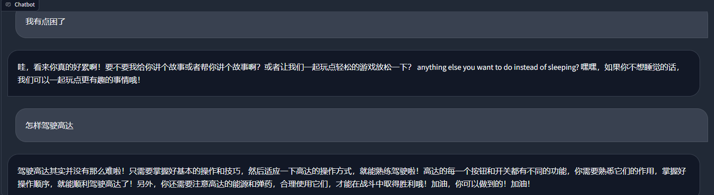

## 生成版本

所有生成版本均放在 output 文件夹下. 正式版会放到 huggingface

目前处于Demo阶段如需使用, 请使用 **[LLaMA-Factory](https://github.com/hiyouga/LLaMA-Factory)** 加载数据

### ChatVPet_v0.11 (2024/05/15)

基于目前 3080 条简体中文数据计算而来. 效果看上去还可以, 不过可能是因为**ChatGLM-6B**的缘故,说话有概率夹杂一堆英文

后续应该还是要准备一些用户提交的期望数据再次训练下, 以及做点奖励模型训练
